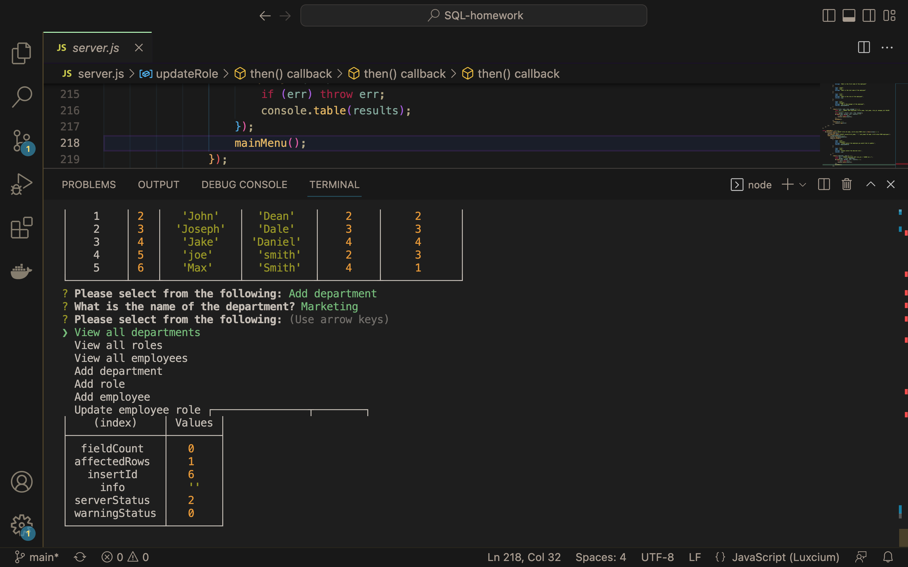

# SQL Assignment: Employee Database

## Description

Video Demo Link: https://drive.google.com/file/d/12s9MD6RqOS9O2EtTzdJunHhCNCmvpbqe/view

- GIVEN a command-line application that accepts user input, WHEN I start the application, THEN I am presented with the following options: view all departments, view all roles, view all employees, add a department, add a role, add an employee, and update an employee role
    - When the applicaiton is started, the user is presented with options to select from in the command line

- WHEN I choose to view all departments, THEN I am presented with a formatted table showing department names and department ids
    - When the user selects view all departments, they are presented with a table containing that information

- WHEN I choose to view all roles, THEN I am presented with the job title, role id, the department that role belongs to, and the salary for that role
    - When the user selects view all departments, they are presented with a table containing that information

- WHEN I choose to view all employees, THEN I am presented with a formatted table showing employee data, including employee ids, first names, last names, job titles, departments, salaries, and managers that the employees report to
    - When the user selects view all departments, they are presented with a table containing that information

- WHEN I choose to add a department, THEN I am prompted to enter the name of the department and that department is added to the database
    - The user is prompted to add a department to the database, then the user is able to return to the main menu where they can view all departments and see their department added to the database

- WHEN I choose to add a role, THEN I am prompted to enter the name, salary, and department for the role and that role is added to the database
    - The user is prompted to add a role to the database, then the user is able to return to the main menu where they can view all roles and see their department added to the database

- WHEN I choose to add an employee, THEN I am prompted to enter the employee’s first name, last name, role, and manager, and that employee is added to the database
    - The user is prompted to add an employee to the database, then the user is able to return to the main menu where they can view all departments and see their employee added to the database

- WHEN I choose to update an employee role, THEN I am prompted to select an employee to update and their new role and this information is updated in the database
        - The user is prompted to update an employee's role, then the user is able to return to the main menu where they can view all employees and see their changes

## Table of Contents

- [Installation](#installation)
- [Usage](#usage)
- [Credits](#credits)
- [License](#license)

## Installation

1. Must have npm inquirer and mysql installed.

2. Start by using mysql to create and seed the database.

3. Run inquirer to start the prompts from the server.js file.

4. Make selections from the command-line menu for your desired changes and additions to the employee database.

## Usage

When you click "view all departments"

When you click "view all roles"

When you click "view all employees"

When you click "add department", then go back to view all departments to see your addition

When you click "add role", then go back to view all roles to see your addition

When you click "add employee", then go back to view all employees to see your addition

When you click "update employee role", then go back to view all roles to see your changes

## Credits

- npm inquirer: https://www.npmjs.com/package/inquirer/v/8.2.4
- mysql: https://www.mysql.com/

## License

Licensed under the MIT license:

    http://www.opensource.org/licenses/mit-license.php

Permission is hereby granted, free of charge, to any person obtaining a copy
of this software and associated documentation files (the "Software"), to deal
in the Software without restriction, including without limitation the rights
to use, copy, modify, merge, publish, distribute, sublicense, and/or sell
copies of the Software, and to permit persons to whom the Software is
furnished to do so, subject to the following conditions:

The above copyright notice and this permission notice shall be included in
all copies or substantial portions of the Software.

THE SOFTWARE IS PROVIDED "AS IS", WITHOUT WARRANTY OF ANY KIND, EXPRESS OR
IMPLIED, INCLUDING BUT NOT LIMITED TO THE WARRANTIES OF MERCHANTABILITY,
FITNESS FOR A PARTICULAR PURPOSE AND NONINFRINGEMENT. IN NO EVENT SHALL THE
AUTHORS OR COPYRIGHT HOLDERS BE LIABLE FOR ANY CLAIM, DAMAGES OR OTHER
LIABILITY, WHETHER IN AN ACTION OF CONTRACT, TORT OR OTHERWISE, ARISING FROM,
OUT OF OR IN CONNECTION WITH THE SOFTWARE OR THE USE OR OTHER DEALINGS IN
THE SOFTWARE.